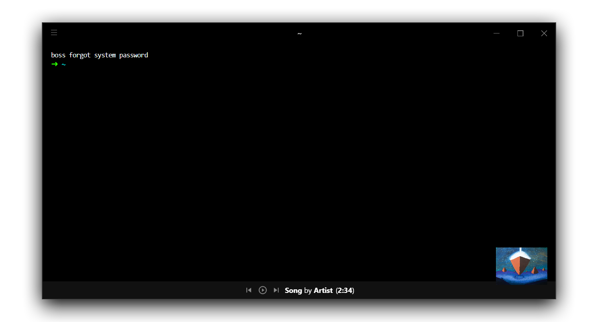

# hyper-media-control

[](LICENSE)
[](https://github.com/zeit/hyper/releases/tag/2.0.0)
[](https://github.com/OrionNebula/hyper-media-control/issues)
[](https://npmjs.com/hyper-media-control)

> Extensible media player controller for [Hyper](https://hyper.is).
Displays the song currently playing in your media player at the bottom of the terminal and allows you to control your favorite music.

This is an empty shell for media player control. You must install another plugin for the media player of your choice.



## Installation

Add `hyper-media-control` to your Hyper configuration, plus any control plugins you want.

## Configuration

Configuration will depend largely on the control plugins you have installed, but there are some global configuration options available.

```js
module.exports = {
    config: {
        ...
        hyperMedia : {
            showArtwork: true, // True if artwork should appear in the bottom right corner.
            // Control plugins will place their config here.
        }
        ...
    }
}
```

## Control Plugins

Here's a list of known control plugins. Submit a pull request if you create one!

Name | Description | Downloads
---- | ----------- | ---------
hyper-media-control-gpmdp | Connect to [GPMDP](https://www.googleplaymusicdesktopplayer.com/) | [](https://npmjs.com/hyper-media-control-gpmdp)
hyper-media-control-vlc | Connect to VLC Media Player | [](https://npmjs.com/hyper-media-control-vlc)
hyper-media-control-foobar2000-httpcontrol | Connect to foobar2000 via the foo_httpcontrol component. | [](https://npmjs.com/hyper-media-control-foobar2000-httpcontrol)
hyper-media-control-upnp | Connect to UPNP devices on your network. | [](https://npmjs.com/hyper-media-control-upnp)

## Development

This package relies on [`hyper-plugin-extend`](https://github.com/OrionNebula/hyper-plugin-extend) for integrating with control plugins. The parent plugin name is `hyper-media-control`.

To create a media control plugin, create a class that derives from `EventEmitter` and contains the following events / methods:

Method / Event Name | Description
----------- | -----------
`constructor(playerManager, config)` | Constructs a new instance of this player controller. The first argument is the PlayerManager instance from `hyper-media-control`. The second argument is the `hyperMedia` object from config in .hyper.js.
`playerName()` | Returns the name of the player. By convention, this is all lowercase.
`iconUrl()` | Returns a URL to the icon for the player. This should be 64x64 pixels.
`activate()` | Activates the player, enabling it to return events.
`deactivate()` | Deactivates the player, shutting down events.
`status` | Emitted whenever a new status object is available. First argument is a `Status` object describing player status.

`Status` object structure:
```js
{
    isRunning: true | false, // True if the player this is intended to control is running. False otherwise.
    state: 'playing' | 'paused' | 'stopped', // The state of playback.
    progress: 3000, // Progress through the track, in milliseconds. This field is optional.
    track: { // The currently playing track.
        name: 'name', // The playing track's name.
        artist: 'artist', // The playing track's artist.
        coverUrl: '...' // A URL pointing to this track's album art. This field is optional.
        duration: 3000 // The total length of the current track, in milliseconds. This field is optional.
    }
}
```

The following methods are not required, but when implemented, enable `hyper-media-control` to control playback.

Method Name | Description
----------- | -----------
`playPause()` | Toggles playback. Returns a `Promise` for a `Status` object.
`nextTrack()` | Moves playback to the next track. Returns a `Promise` for a `Status` object.
`previousTrack()` | Moves playback to the previous track. Returns a `Promise` for a `Status` object.

## Special Thanks

Special thanks to [@panz3r](https://github.com/panz3r) and his Hyper plugin [`hyper-spotify`](https://github.com/panz3r/hyper-spotify) for inspiring me to create this plugin. I learned a lot about React and Hyper studying his code. Go give him a star/follow!
